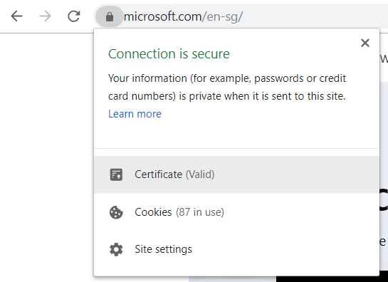
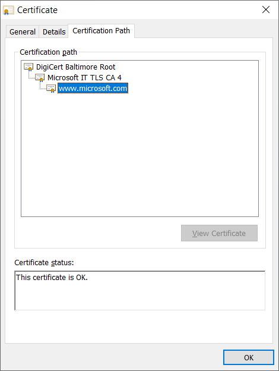
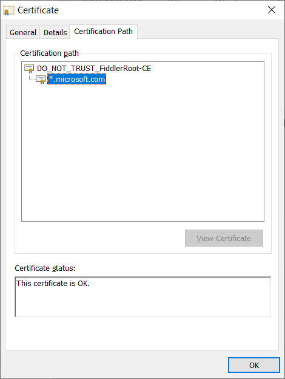
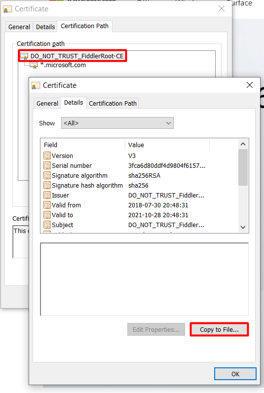
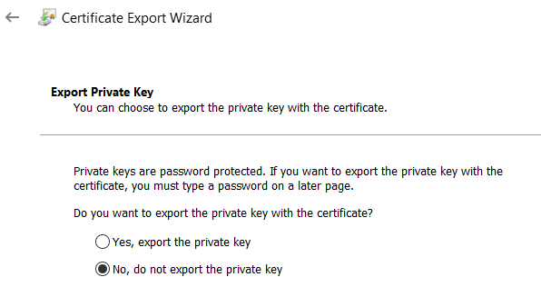
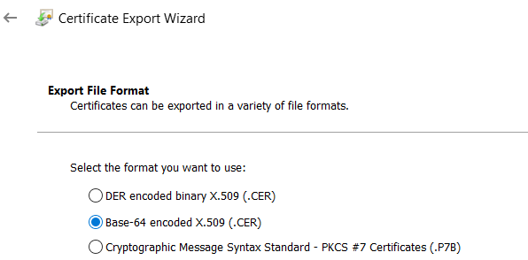

# Use Azure CLI behind a proxy

> The official guidance is at https://github.com/Azure/azure-cli/blob/dev/doc/use_cli_effectively.md#working-behind-a-proxy. The following contents includes more detailed instructions.

Sometimes we may want to capture Fiddler trace for Azure CLI, or the company's network is forced to use a proxy and the proxy is intercepting HTTPS traffic using a self-signed certificate. In such case, Python [requests library] which CLI depends on will throw `SSLError("bad handshake: Error([('SSL routines', 'tls_process_server_certificate', 'certificate verify failed')],)",)`. Some configurations are needed on Azure CLI to make it work properly. 

The best way to check if HTTPS is intercepted by a proxy is to check with Chrome. (If the proxy is not intercepting HTTPS, it won't bother CLI, so we don't need below steps.)  

Click on the :lock: icon to the left of the URL and select **Certificate**.



If HTTPS traffic is not intercepted, the root CA should be a public CA, like DigiCert.



If HTTPS traffic is intercepted by the proxy, the root CA should be a self-signed certificate or a certificate issued by the company's IT department, something like:



There are 2 ways to handle this error.

## Disable SSL verification

Disable the certificate check across the CLI by setting the environment variable of `AZURE_CLI_DISABLE_CONNECTION_VERIFICATION` to any value. This is not safe, but good for a short period like you want to capture a trace for a specific command and promptly turn it off after done. This currently doesn't work with data-plane operations, like [azure-storage-python](https://github.com/Azure/azure-storage-python), because the library doesn't have a built-in way to disable SSL verification. 

### CMD

```batch
set AZURE_CLI_DISABLE_CONNECTION_VERIFICATION=1
```

### PowerShell

`set` doesn't work in PowerShell because PowerShell's `set` is an alias to `Set-Variable`, which only changes the script's variables. See [about_environment_variables](https://docs.microsoft.com/en-us/powershell/module/microsoft.powershell.core/about/about_environment_variables?view=powershell-6).

```powershell
$Env:AZURE_CLI_DISABLE_CONNECTION_VERIFICATION=1
```

### Linux

```bash
export AZURE_CLI_DISABLE_CONNECTION_VERIFICATION=1
```

## Change the CA bundle

This is recommended if you use CLI frequently behind a corporate proxy. 

- If `REQUESTS_CA_BUNDLE` is set, [requests library] reads the CA bundle (in PEM, Privacy Enhanced Mail format) from this location.
- If `REQUESTS_CA_BUNDLE` is not set, [requests library] reads from the default location: `C:\Program Files (x86)\Microsoft SDKs\Azure\CLI2\Lib\site-packages\certifi\cacert.pem` on Windows and ` /opt/az/lib/python3.6/site-packages/certifi/cacert.pem` on Linux. 

You may either 
- Append the proxy server's certificate to the default CA bundle, or
- Copy the default CA bundle to another location, append the proxy's certificate, then set `REQUESTS_CA_BUNDLE` to it. 

To export the proxy's certificate, go back to Chrome. Click **Copy to File...**. 



Select **No, do not export the private key**.



Select **Base-64 encoded X.509 (.CER)**.



Fiddler's current (2019-08-20) root certificate is:

```
-----BEGIN CERTIFICATE-----
MIIDsjCCApqgAwIBAgIQP8ptgN302YBPYVf50e6xfDANBgkqhkiG9w0BAQsFADBn
MSswKQYDVQQLDCJDcmVhdGVkIGJ5IGh0dHA6Ly93d3cuZmlkZGxlcjIuY29tMRUw
EwYDVQQKDAxET19OT1RfVFJVU1QxITAfBgNVBAMMGERPX05PVF9UUlVTVF9GaWRk
bGVyUm9vdDAeFw0xODA3MzAxMjQ4MzFaFw0yMTEwMjgxMjQ4MzFaMGcxKzApBgNV
BAsMIkNyZWF0ZWQgYnkgaHR0cDovL3d3dy5maWRkbGVyMi5jb20xFTATBgNVBAoM
DERPX05PVF9UUlVTVDEhMB8GA1UEAwwYRE9fTk9UX1RSVVNUX0ZpZGRsZXJSb290
MIIBIjANBgkqhkiG9w0BAQEFAAOCAQ8AMIIBCgKCAQEAm4kCm94NDkJ91DMcTBjq
z/u1LPkiXlBbcknTEp4CBkEtVr8rfGmm058M01QikoLigh8OISeU+MbCao/8fvCg
+TFYHQFFZONKw6sad4IHN6iHwVpPXgfCtP52ZnCGfntrlNJdikQeycPjDSJNDLpy
XGuNkIwk2jREts+u61EF0459CPtyGn9bpxfDQ5LNP5YJ/1dXnslUJAXTLvP4xBKT
u2QP+5OmOjKTHXP53lqqW0rOioijj6PsvPNf+517SoFJrMR5Q9P+FT6BSYav83kU
F/NvIWNRQLrGgx5BXjc4WXDhnC9mM8pUghj4lEfAEBXn/qmntedp4IZoIWbSbANL
lQIDAQABo1owWDATBgNVHSUEDDAKBggrBgEFBQcDATASBgNVHRMBAf8ECDAGAQH/
AgEAMB0GA1UdDgQWBBS18ByP6P35iRo34tV/nbc8FZ0X9DAOBgNVHQ8BAf8EBAMC
AQYwDQYJKoZIhvcNAQELBQADggEBAGa9svmawn4LYELUrotMQVeZF57hPSExWzpr
7UbHMOtoIfGGu1AMosJFfvTZIEhPePLQuZqIQwdSm9m7kmFegqLqoBYjTJRq9mur
KvJvGDXyyTNN2rQV0qf0JL7LFp5XdiltTABtfRKHKZ5vGZPi6lanQwsvBUryShHe
erNP1JIg0ZXS0yFJUdtLYnhFOUqp/ZutWYJjsBB/GMqpHp8rYl6vJSE0pzhRITjP
xk586Tj0RBCby4DJw35AwQeuk9lBqNCVjtNZkKKhEUmAAut6cnLsHWTbV136OcP1
y5useyKJgGCR9p7TWOW2PVz968WH8U/tq3orip3CaTsstGoyt+c=
-----END CERTIFICATE-----
```

Then open the cacert.pem file with a text editor and append the exported certificate.

```
<Original cacert.pem>

-----BEGIN CERTIFICATE-----
<Your proxy's certificate here> 
-----END CERTIFICATE-----
```

A frequent ask is whether or not `HTTP_PROXY` or `HTTPS_PROXY` environment variables should be set, the answer is it depends. For fiddler on Windows, by default it acts as system proxy on start, you don't need to set anything. If the option is off or using other tools which don't work as system proxy, you should set them. Since almost all traffics from CLI are SSL based, so only `HTTPS_PROXY` should be set. If you are not sure, just set them, but do remember to unset it after the proxy is shut down. For fiddler, the default value is `http://localhost:8888`.

For other details, check out [Stefan's blog](https://blog.jhnr.ch/2018/05/16/working-with-azure-cli-behind-ssl-intercepting-proxy-server/).

[requests library]: https://github.com/kennethreitz/requests
